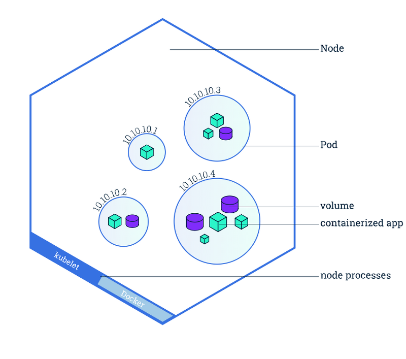

# Chapter 2 정리

## Docker

`docker container`는 리눅스 네임스페이스 기술을 이용하여 독립된 환경을 구성하는 방법이다.

`docker hub`는 docker image의 원격 저장소를 말하는데, 이 저장소에 이미지를 저장하고 가져올 수 있다.

### Dcoker 이미지 가져오기

docker 이미지를 가져오려면 `docker image pull <image>:<tag>` 명령을 입력하면 된다. 이미지를 가져오고 즉시 실행하려면 `docker run <image>:<tag>`

### Docker 이미지 만들기

docker 이미지를 만들려면 `Dockerfile`을 작성해야한다. 보통 base 이미지에 추가 작업을 하는 경우가 많다.

  **Dockerfile**

    ```
    FROM node:7
    ADD app.js /app.js
    ENTRYPOINT ["node", "app.js"]
    ```

`Dockerfile`을 이미지로 만들려면 `docker build -t <name> <directory>` 명령어를 이용하면 된다. 위에서 작성한 `Dockerfile`이 현재 디렉토리에 있다면 `docker build -t kubia .`를 입력하면 된다.

### 이미지 레이어

docker의 이미지는 하나의 큰 덩어리가 아니라 `layer`라는 단위로 나뉘어 있다. 서로 다른 이미지라도 중복된 `layer`가 존재한다면 docker는 이미지를 전송하거나 다운로드 받을 때, 해당 레이어는 건너뛰기 때문에 저장공간도 아끼고 속도도 빠르다.

### 컨테이너 실행

이미지를 이용해 컨테이너를 띄우고 싶다면 아래와 같이 명령어를 입력하면 된다.

```bash
docker run --name kubia-container -p 8080:8080 -d kubia
```

위 옵션을 설명하자면, `name`은 컨테이너의 이름, `p`는 컨테이너의 내부 포트와 호스트 포트의 매핑, `d`는 이용할 이미지를 나타낸다.

### 컨테이너 내부에 접근하기

컨테이너에 bash로 접근하고 싶다면 아래의 명렁어를 이용하면 된다.

```bash
# docker exec -it <container name> <command>
docker exec -it kubia-container bash
```

### 컨테이너 중지 및 삭제

컨테이너를 중지하려면 `docker stop <container name>`, 삭제하려면 `docker rm <container name>`을 입력하면 된다. 중지해도 `docker ps -a` 명령어로 조회해보면 정지된 상태로 남아있다.

### 이미지를 레지스트리에 올리기

`docker tag <image> <new image>`로 이미지를 태그한다.

`docker login`으로 docker hub에 로그인한다.

`docker push <image>`로 이미지를 레지스트리에 올린다.

## Kubernetes

우선은 쿠버네티스는 컨테이너를 여러개 띄우는 클러스터라고 알아두자

### minikube

로컬에서 쿠버네티스 클러스터를 테스트하고 싶다면 `minikube`를 설치하면 된다. [설치 링크](http://github.com/kubernetes/minikube)

설치 후 `kubectl cluster-info` 명령어를 입력해보면 클러스터 정보를 확인할 수 있다. (minikube 설치하면 kubectl에 자동으로 연결됨)

### Pod

`pod`은 연관된 여러개의 컨테이너 그룹이다. 각 파드는 IP, 호스트 이름, 프로세스 등이 논리적으로 분리되어 있다.

<div style="text-align : center;">
  
</div>

위에서 작성한 `kubia` 이미지를 pod로 띄워보자.

```bash
kubectl run kubia --image=kyc8909/kubia --port=8080 --generator=run/v1
```

만들어진 pod를 조회하려면 `kubectl get pods` 명령어를 입력하면 된다. 방금 만들어진 pod의 `STATUS`가 `Pending`이라면, 컨테이너 이미지를 아직 다 다운로드하지 않은 것이다. 기다리면 `Running`으로 변경된다.

### 백그라운드 동작 이해하기

`kubectl` 명령어로 pod을 생성하면,

 1. 쿠버네티스 API 서버로 pod 생성 요청을 보낸다.
 2. [`ReplicationController`](https://kubernetes.io/ko/docs/concepts/workloads/controllers/replicationcontroller/)가 새 pod를 생성한다.
 3. 스케쥴러가 새 pod를 워커 노드 중 하나에 할당한다.
 4. `kublet`이 이미지가 로컬에 없으면 도커 허브에서 `pull`하도록 지시한다.

인터넷에 좋은 그림이 있어서 하나 가져왔다. (출처: https://blog.2dal.com/2018/04/30/kubernetes-02-replicaset/)

<div style="text-align : center;">
  
</div>

레플리케이션 컨트롤러는 항상 지정한 개수의 pod을 유지하도록 하는 역할을 한다. 오류와 같은 이유로 pod이 죽는다면, 레플리케이션 컨트롤러가 새로운 pod를 생성한다.

### 서비스 오브젝트

각 pod는 IP 주소를 가지고 있지만, 클러스터 내부에 있어서 외부에선 접근이 불가능하다. 외부에서 pod에 접근을 가능하게 하려면 `서비스 오브젝트`를 통해 노출해야 한다.

```bash
# rc는 replication controller의 약어다
kubectl expose rc kubia --type=LoadBalancer --name=kubia-http
```

서비스가 잘 만들어졌는지 확인하려면 `kubectl get services` 명령어를 입력하면 된다.

`curl` 명령어로 외부에서 잘 접근되는지 `EXTERNAL-IP`로 호출해보면 된다.

minikube에선 로드밸런서를 지원하지 않아서 서비스가 외부 IP를 지원하지 않는다. 대신 아래 명령어로 외부 포트를 할당 받아 호출해볼 수 있다.

```bash
# minikube service <service name>
minikube service kubia-http

...

curl 127.0.0.1:55304
```

서비스는 이처럼 연관된 여러개의 pod들을 하나의 IP 주소로 접근할 수 있도록 하는데, 이를 그림으로 표현하면 아래와 같다. (출처: https://blog.leocat.kr/notes/2019/08/22/translation-kubernetes-nodeport-vs-loadbalancer-vs-ingress)

<div style="text-align : center;">
  
</div>

위 그림에서 `Ingress`는 나중에 알아보자.

서비스가 중요한 이유는 IP 주소가 유지된다는 것이다. pod은 일시적이고, 사라졌다가 새로 생성되면 새로운 IP 주소를 할당받기때문에 서비스가 꼭 필요하다. 따라서 서비스는 하나 이상의 pod의 `정적 위치`를 나타낸다고 할 수 있다.

### Scale Out

애플리케이션을 수평 확장해보자. 레플리카 개수를 주어 레플리케이션 컨트롤러가 관리하는 pod의 개수를 늘릴 수 있다.

```bash
kubectl scale rc kubia --replicas=3
```

스케일 아웃 결과를 보기 위해 레플리케이션 컨트롤러의 정보를 조회해보자.

```bash
kubectl get rc

NAME    DESIRED   CURRENT   READY   AGE
kubia   3         3         3       83m
```

pod도 조회해보면 1개가 아니라 3개가 나온다.

```bash
kubectl get pods

NAME          READY   STATUS              RESTARTS   AGE
kubia-2f7js   0/1     ContainerCreating   0          4s
kubia-9lmrt   0/1     ContainerCreating   0          4s
kubia-jr6j9   1/1     Running             0          83m
```

### node 정보 조회해보기

pod가 할당된 노드의 정보를 보고 싶다면 `kubectl get pods -o wide` 명령어를 입력하면 된다.

위 명령어를 입력하면 pod의 아이피와 할당된 노드의 정보를 보여준다.

`kubectl describe pod <pod name>`을 이용하면 더 자세한 pod의 정보를 볼 수 있다.

### 대시보드

`minikube`에서 대시보드를 보려면 `minikube dashboard` 명령어를 입력하면 된다.
