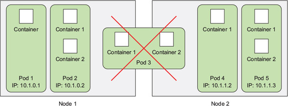
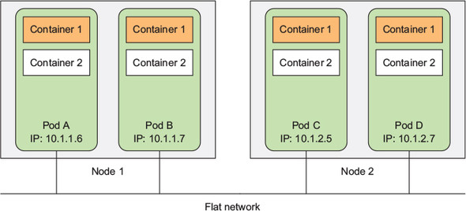
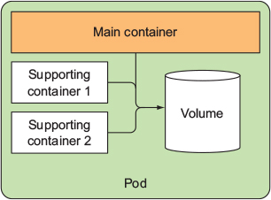
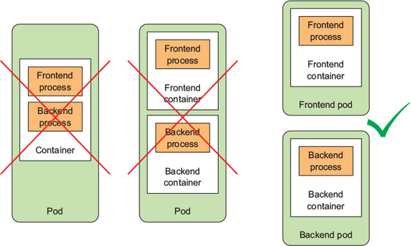

# Chapter 3 정리

## Pod

pod는 연관된 컨테이너를 하나로 묶은 단위이다. pod는 node에 포함이 되는데, pod가 여러개의 컨테이너를 가지고 있을 경우 서로 다른 노드에 컨테이너가 존재할 수는 없다.

  

### 다중 프로세스보다 다중 컨테이너

컨테이너는 단일 프로세스를 실행하는 것을 목적으로 설계됐다. 하나의 컨테이너에서 여러개의 프로세스를 관리하면 아래와 같은 상황에 문제될 수 있다.

 1. 프로세스가 실패할 경우

    프로세스가 실패하면 재시작하는 메커니즘이 있어야하는데, 컨테이너를 재시작하는 것보다 복잡하다.

 2. 로그를 남기는 경우

    동일한 컨테이너에 여러 프로세스가 있는 경우, 서로 다른 프로세스의 로그가 혼재되어 컨테이너의 문제가 발생했을 때 해결하기가 어렵다.

### Pod가 필요한 이유

`Pod`를 이용하면 위와 같은 문제를 겪지 않으면서, 연관된 여러 프로세스를 하나로 묶을 수 있고, 컨테이너로 프로세스끼리 격리된 상태를 유지할 수 있다.

#### 부분 격리

`Pod`은 연관된 컨테이너가 마치 하나인 것처럼 만들기 위해 위해 `부분 격리`를 제공한다.

`Pod` 안의 컨테이너는 동일한 네트워크 네임스페이스와 UTS(UNIX Timesharing System) 네임스페이스를 가진다. 따라서 `Pod` 안의 컨테이너끼리 같은 호스트 이름을 가지고 있고, IP 주소와 포트 공간을 공유한다.
또한 IPC 네임스페이스도 공유해서 IPC로 서로 통신할 수 있다.

#### Flat Network

쿠버네티스 클러스터의 모든 `Pod`는 하나의 `Flat Network` 주소 공간에 있어서 `Pod`끼리 IP 주소로 통신하는 것이 가능하다.

    Flat Network는 계층 구조를 가지지 않고 단일 네트워크에 연결된 상태를 말한다.

  

따라서 `Pod` 간 통신 시 서로 같은 노드에 존재하는지 등의 여부를 신경쓰지 않아도 된다.

### Pod와 Container의 구성

여러개의 컨테이너를 하나의 `Pod`로 만들어도 되지만 이는 여러가지 이유로 좋지 않은 선택이다. `Pod`가 밀접한 컨테이너만 묶어야 하는 이유를 알아보자

#### 인프라 활용

프론트엔드와 백엔드가 하나의 `Pod`에 존재한다고 가정하자. 2개의 노드를 가진 클러스터가 있는데 `Pod`가 하나라면, 하나의 노드밖에 활용하지 못할것이다.

#### 개별 확장

프론트엔드와 백엔드가 하나의 `Pod`에 존재하는데 백엔드의 요청량이 늘어나 `Pod`을 2개로 늘렸다. 그럼 프론트엔드는 리소스가 더 필요하지 않은데 할당받게 되는 것이다.
이처럼 서로 다른 확장 요구사항을 가지고 있는 경우 별도의 `Pod`으로 나누는게 맞다.

#### 사이드카 컨테이너

여러 컨테이너를 단일 `Pod`에 넣는 경우는 아래 그림처럼 자원 등을 공유하여 밀접하게 관련된 컨테이너들이다. 보통 하나의 주 컨테이너가 존재하고 나머지 지원 컨테이너들로 구성된다.
이런 지원 컨테이너들을 사이드카 컨테이너라고 부른다. 사이드카 컨테이너의 예제로는 로그 수집기, 데이터 프로세서, 통신 어댑터 등이 있다.

  

위 요소들을 고려하여 컨테이너를 같은 `Pod`에 넣어야할지 결정하려면 아래의 질문들을 해야한다.

 - 컨테이너가 같은 호스트에서 실행돼야 하는가
 - 여러 컨테이너가 모여 하나의 구성 요소를 나타내는가
 - 컨테이너가 함께 스케일링돼야 하는가

  

