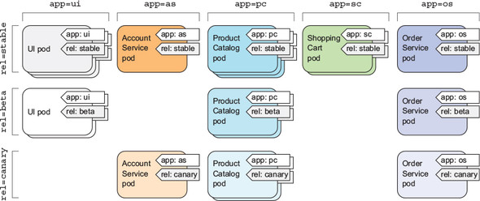
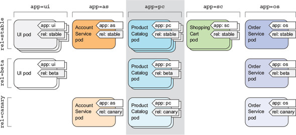
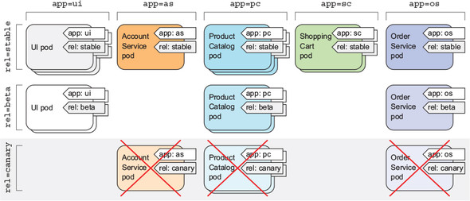

# Chapter 3 정리

## Pod

pod는 연관된 컨테이너를 하나로 묶은 단위이다. pod는 node에 포함이 되는데, pod가 여러개의 컨테이너를 가지고 있을 경우 서로 다른 노드에 컨테이너가 존재할 수는 없다.

<div style="text-align : center;">
  
</div>

### 다중 프로세스보다 다중 컨테이너

컨테이너는 단일 프로세스를 실행하는 것을 목적으로 설계됐다. 하나의 컨테이너에서 여러개의 프로세스를 관리하면 아래와 같은 상황에 문제될 수 있다.

 1. 프로세스가 실패할 경우

    프로세스가 실패하면 재시작하는 메커니즘이 있어야하는데, 컨테이너를 재시작하는 것보다 복잡하다.

 2. 로그를 남기는 경우

    동일한 컨테이너에 여러 프로세스가 있는 경우, 서로 다른 프로세스의 로그가 혼재되어 컨테이너의 문제가 발생했을 때 해결하기가 어렵다.

### Pod가 필요한 이유

`Pod`를 이용하면 위와 같은 문제를 겪지 않으면서, 연관된 여러 프로세스를 하나로 묶을 수 있고, 컨테이너로 프로세스끼리 격리된 상태를 유지할 수 있다.

#### 부분 격리

`Pod`은 연관된 컨테이너가 마치 하나인 것처럼 만들기 위해 위해 `부분 격리`를 제공한다.

`Pod` 안의 컨테이너는 동일한 네트워크 네임스페이스와 UTS(UNIX Timesharing System) 네임스페이스를 가진다. 따라서 `Pod` 안의 컨테이너끼리 같은 호스트 이름을 가지고 있고, IP 주소와 포트 공간을 공유한다.
또한 IPC 네임스페이스도 공유해서 IPC로 서로 통신할 수 있다.

#### Flat Network

쿠버네티스 클러스터의 모든 `Pod`는 하나의 `Flat Network` 주소 공간에 있어서 `Pod`끼리 IP 주소로 통신하는 것이 가능하다.

    Flat Network는 계층 구조를 가지지 않고 단일 네트워크에 연결된 상태를 말한다.

<div style="text-align : center;">
  
</div>

따라서 `Pod` 간 통신 시 서로 같은 노드에 존재하는지 등의 여부를 신경쓰지 않아도 된다.

### Pod와 Container의 구성

여러개의 컨테이너를 하나의 `Pod`로 만들어도 되지만 이는 여러가지 이유로 좋지 않은 선택이다. `Pod`가 밀접한 컨테이너만 묶어야 하는 이유를 알아보자

#### 인프라 활용

프론트엔드와 백엔드가 하나의 `Pod`에 존재한다고 가정하자. 2개의 노드를 가진 클러스터가 있는데 `Pod`가 하나라면, 하나의 노드밖에 활용하지 못할것이다.

#### 개별 확장

프론트엔드와 백엔드가 하나의 `Pod`에 존재하는데 백엔드의 요청량이 늘어나 `Pod`을 2개로 늘렸다. 그럼 프론트엔드는 리소스가 더 필요하지 않은데 할당받게 되는 것이다.
이처럼 서로 다른 확장 요구사항을 가지고 있는 경우 별도의 `Pod`으로 나누는게 맞다.

#### 사이드카 컨테이너

여러 컨테이너를 단일 `Pod`에 넣는 경우는 아래 그림처럼 자원 등을 공유하여 밀접하게 관련된 컨테이너들이다. 보통 하나의 주 컨테이너가 존재하고 나머지 지원 컨테이너들로 구성된다.
이런 지원 컨테이너들을 사이드카 컨테이너라고 부른다. 사이드카 컨테이너의 예제로는 로그 수집기, 데이터 프로세서, 통신 어댑터 등이 있다.

<div style="text-align : center;">
  
</div>

위 요소들을 고려하여 컨테이너를 같은 `Pod`에 넣어야할지 결정하려면 아래의 질문들을 해야한다.

 - 컨테이너가 같은 호스트에서 실행돼야 하는가
 - 여러 컨테이너가 모여 하나의 구성 요소를 나타내는가
 - 컨테이너가 함께 스케일링돼야 하는가

<div style="text-align : center;">
  
</div>

## Yaml로 Pod 생성

`kubectl run`으로도 리소스를 생성할 수 있지만 제한된 속성만 사용할 수 있다. 

yaml 파일로 쿠버네티스 오브젝트를 정의하면 버전 관리 시스템으로 관리할 수 있다.

쿠버네티스 오브젝트를 정의할 때 [쿠버네티스 API Reference](https://kubernetes.io/docs/reference)를 참고하자

### Yaml 매니페스트로 Pod 만들기

매니페스트의 각 속성을 자세히 살펴보고 싶다면 [링크](https://kubernetes.io/docs/concepts/overview/kubernetes-api/)를 참고하거나, `kubectl explain` 명령어를 입력하자.

**속성 조회**
```bash
kubectl explain pods

KIND:     Pod
VERSION:  v1

DESCRIPTION:
     Pod is a collection of containers that can run on a host. This resource is
     created by clients and scheduled onto hosts.

FIELDS:
   apiVersion   <string>
     ...
   kind <string>
     ...
   metadata <Object>
     ...
```

**세부 속성 조회**
```bash
kubectl explain pod.spec

KIND:     Pod
VERSION:  v1

RESOURCE: spec <Object>

DESCRIPTION:
  ...
```

간단한 매니페스트로 Pod를 만들어보자.

**kubia-manual.yaml**
```yaml
apiVersion: v1
kind: Pod
metadata:
  name: kubia-manual
spec:
  containers:
  - image: luksa/kubia
    name: kubia
    ports:
    - containerPort: 8080
      protocol: TCP
```

```bash
# kubectl create -f <manifest>
kubectl create -f kubia-manual.yaml

...

kubectl get pods
```

`kubectl get po <pod name> -o yaml` 명령어를 입력하면 yaml 디스크립터를 확인할 수 있다.

```bash
kubectl get po kubia-manul -o yaml
```

### 애플리케이션 로그

`kubectl logs <pod name>` 명령어로 `Pod` 내부의 로그를 가져올 수 있다.

컨테이너가 여러개인 `Pod`의 로그를 보려면 컨테이너를 명시 해줘야한다.

`kubectl logs kubia-manual -c kubia`

## 레이블

`레이블`은 다수의 `Pod`을 임의의 작은 그룹으로 나눌 때 사용한다. 
`레이블`은 리소스에 첨부하는 `키-값` 쌍으로, 이를 이용해 리소스를 선택할 때 사용한다.

<div style="text-align : center;">
  
</div>

위 그림은 `Pod`에 애플리케이션 종류(app), 애플리케이션 상태(rel)를 레이블로 붙인 모습이다.

### 레이블을 붙여 Pod 생성

yaml 매니페스트로 `Pod`에 레이블을 붙이려면 아래와 같이 `metadata.labels`속성에 레이블을 추가하면 된다.

**kubia-manual-with-labels.yaml**
```yaml
apiVersion: v1
kind: Pod
metadata:
  name: kubia-manual-v2
  # add labels
  labels:
    creation_method: manual
    env: prod
spec:
  containers:
  - image: luksa/kubia
    name: kubia
    ports:
    - containerPort: 8080
      protocol: TCP
```

`Pod`을 생성하고 레이블을 확인해보자

```bash
# create pods
kubectl create -f kubia-manual-with-labels.yaml

# show pods with labels
kubectl get po --show-labels

NAME              READY   STATUS    RESTARTS   AGE    LABELS
kubia-5f5gs       1/1     Running   0          121m   run=kubia
kubia-bhkxx       1/1     Running   0          119m   run=kubia
kubia-manual      1/1     Running   0          106m   <none>
kubia-manual-v2   1/1     Running   0          7s     creation_method=manual,env=prod
kubia-s7cb5       1/1     Running   0          119m   run=kubia
```

레이블을 추가 또는 변경하려면 `kubectl label` 명령을 사용한다.

```bash
# add a new label to the pod
kubectl label po kubia-manual creation_method=manual

# overwrite the label
kubectl label po kubia-manual-v2 env=debug --overwrite

kubectl get po --show-labels

NAME              READY   STATUS    RESTARTS   AGE     LABELS
kubia-5f5gs       1/1     Running   0          128m    run=kubia
kubia-bhkxx       1/1     Running   0          126m    run=kubia
kubia-manual      1/1     Running   0          114m    creation_method=manual
kubia-manual-v2   1/1     Running   0          7m39s   creation_method=manual,env=debug
kubia-s7cb5       1/1     Running   0          126m    run=kubia
```

### 레이블 셀렉터

`레이블 셀렉터`를 이용해 리소스를 필터링할 수 있다. 필터링하는 기준은 아래와 같다.

 - 특정 키를 포함하는지 여부
 - 특정 키 값과 일치하는지 여부

`kubectl get po -l <label filtering>` 형태로 레이블 셀렉터를 이용할 수 있다.

```bash
# create-method가 manual인 Pod들만 가져오기
kubectl get po -l creation-method=manual

# env 레이블 존재하는 Pod들만 가져오기
kubectl get po -l env

# env 레이블이 존재하지 않는 Pod들만 가져오기
kubectl get po -l '!env'
```

`kubectl get po -l app=pc` 명령어를 입력하면 아래와 같이 `app: pc`인 `Pod`들만 선택된다.

<div style="text-align : center;">
  
</div>

### 특정 노드에 Pod 스케줄링

반드시 GPU를 이용해야하는 `Pod`가 있다면 GPU가 존재하는 노드에 `Pod`를 스케줄링 해야한다.

이런 경우 `Pod`가 아닌 `Node`에 레이블을 추가한다.

```bash
kubectl label node minikube gpu=true

kubectl get nodes -l gpu=true

NAME       STATUS   ROLES    AGE     VERSION
minikube   Ready    master   37m     v1.18.3
```

그 후 `Pod`를 배포할 때 매니페스트에 `nodeSelector` 옵션을 주면, 레이블이 일치하는 노드에 배포된다.

**kubia-gpu.yaml**
```yaml
apiVersion: v1
kind: Pod
metadata:
  name: kubia-gpu
spec:
  # nodeSelector로 레이블 필터링
  nodeSelector:
    gpu: "true"
  containers:
  - image: luksa/kubia
    name: kubia
```

### 어노테이션

쿠버네티스의 리소스는 레이블 외에도 `어노테이션`을 가질 수 있다. 레이블 셀렉터와 같은 식별 정보는 없지만 리소스의 설명을 추가하여 협업할 때 도움이 된다.

`kubectl annotate <resource> <resource name> <annotation>` 명령어로 어노테이션을 추가할 수 있다.

```bash
kubectl annotate pod kubia-manual kyc8909/someannotation="hello"

kubectl describe pod kubia-manual

...
Annotations:  kyc8909/someannotation: hello
...
```

### 네임스페이스

쿠버네티스에서 리소스 그룹을 서로 겹치지 않도록 분할할 때는 `네임스페이스`를 사용한다. 

서로 다른 네임스페이스에 존재하는 리소스들은 이름이 겹쳐도 상관이 없다.

네임스페이스는 리소스를 환경에 따라 분리하는데 많이 사용된다. 프로덕션, 개발, QA 등의 환경에 따라 분리할 수 있다.

#### 네임스페이스 조회

네임스페이스는 `kubectl get namespace` 명령어로 조회할 수 있다.

```bash
# kubectl get ns 도 가능
kubectl get namespace

NAME              STATUS   AGE
default           Active   8h
kube-node-lease   Active   8h
kube-public       Active   8h
kube-system       Active   8h
```

네임스페이스를 지정하지 않고 리소스를 조회하면, 쿠버네티스는 항상 `default` 네임스페이스의 리소스만 보여준다.

리소스를 지정하려면 `--namespace` 또는 `-n` 옵션을 붙이면 된다.

```bash
kubectl get pods --namespace=kube-system

NAME                               READY   STATUS    RESTARTS   AGE
coredns-66bff467f8-cgq69           1/1     Running   0          8h
etcd-minikube                      1/1     Running   0          8h
kube-apiserver-minikube            1/1     Running   0          8h
kube-controller-manager-minikube   1/1     Running   0          8h
kube-proxy-r62x9                   1/1     Running   0          8h
kube-scheduler-minikube            1/1     Running   0          8h
storage-provisioner                1/1     Running   0          8h
```

#### 네임스페이스 생성

네임스페이스도 쿠버네티스 리소스이기 때문에 yaml 파일로 생성할 수 있다.

**custom-namespace**
```yaml
apiVersion: v1
kind: Namespace
metadata:
  name: custom-namespace
```

```bash
kubectl create -f custom-namespace.yaml
```

하지만 네임스페이스를 yaml 파일로 작성하여 만드는 것이 번거롭다면, `kubectl create namespace <namespace name>` 명령어를 이용하면 된다.

```bash
kubectl create namespace customns

kubectl get ns

NAME               STATUS   AGE
customns           Active   5s
default            Active   8h
kube-node-lease    Active   8h
kube-public        Active   8h
kube-system        Active   8h
```

네임스페이스 `Pod`를 생성해보자.

```bash
kubectl create -f kubia-manual.yaml -n customns

kubectl get pods -n customns

NAME           READY   STATUS    RESTARTS   AGE
kubia-manual   1/1     Running   0          7s
```

### Pod 중지와 제거

쿠버네티스 리소스는 `kubectl delete <resource> <resource name>` 명령으로 제거할 수 있다.

#### 이름으로 Pod 제거

`kubectl delete pod kubia-gpu`

쿠버네티스는 `SIGTERM` 신호를 프로세스에 보내고 지정된 시간 (30초) 동안 기다린다. 그 시간내에도 종료되지 않으면 `SIGKILL` 신호로 즉시 종료한다.

#### 레이블 셀렉터로 Pod 제거

`kubectl delete pods -l rel=canary`

레이블 셀렉터가 레이블에 해당하는 `Pod`들을 모두 제거한다.

<div style="text-align : center;">
  
</div>

#### 네임스페이스의 Pod 제거

네임스페이스를 제거해 네임스페이스 존재하는 모든 `Pod`를 삭제할 수 있다.

`kubectl delete ns customns`

네임스페이스를 유지하면서 `Pod`를 삭제할 수도 있다.

`kubectl delete po --all`

하지만 레플리케이션 컨트롤러가 남아있어서 곧 삭제한 `Pod`가 재생성된다.

따라서 레플리케이션을 삭제하고 싶다면 레플리케이션 컨트롤러부터 삭제해야한다. 레플리케이션 컨트롤러가 삭제되면 해당하는 `Pod`들이 같이 삭제된다.

```bash
kubectl get rc

NAME    DESIRED   CURRENT   READY   AGE
kubia   3         3         3       8h

# delete replication controller
kubectl delete rc kubia

kubectl get pods

NAME              READY   STATUS        RESTARTS   AGE
kubia-5f5gs       1/1     Terminating   0          8h
kubia-bhkxx       1/1     Terminating   0          8h
kubia-manual      1/1     Running       0          8h
kubia-manual-v2   1/1     Running       0          6h45m
kubia-s7cb5       1/1     Terminating   0          8h

# few seconds later
kubectl get pods

NAME              READY   STATUS    RESTARTS   AGE
kubia-manual      1/1     Running   0          8h
kubia-manual-v2   1/1     Running   0          6h46m
```
