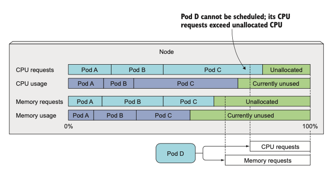
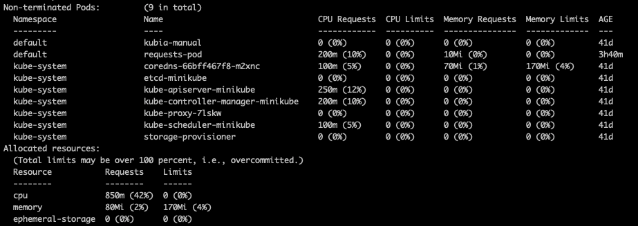
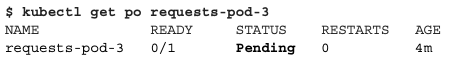
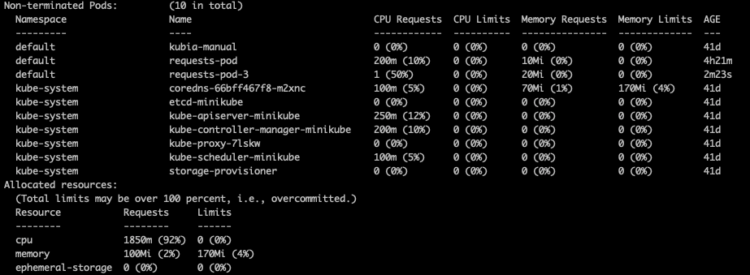
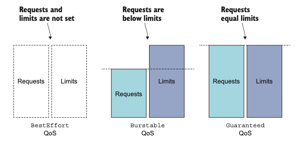
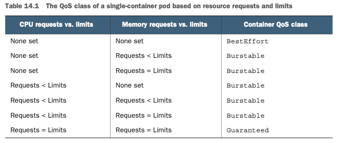
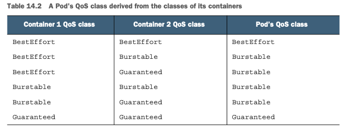
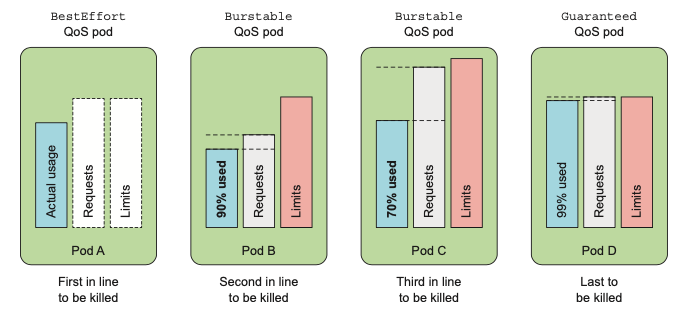
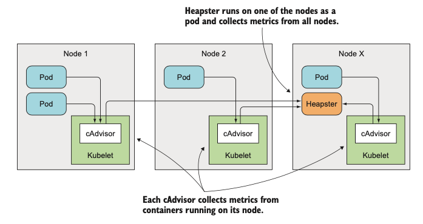

# Chapter 14 정리

이번 장에선 Pod의 리소스를 관리하는 방법에 관해 알아본다.

## Pod 리소스 요청하기

CPU, Memory 같은 리소스는 Pod의 Container 별로 설정할 수 있다.

Container에 필요한 리소스를 `requests`, 최대 리소스 사용량을 `limits`라고 부른다.

```yaml
apiVersion: v1
kind: Pod
metadata:
  name: requests-pod
spec:
  containers:
  - image: busybox
    command: ["dd", "if=/dev/zero", "of=/dev/null"]
    name: main
    resources:
      requests:
        cpu: 200m     # 0.2 core
        memory: 10Mi  # 10 * 2^20 bytes
```

Pod을 생성할 때 리소스 사용량을 따로 명시하지 않으면 컨테이너가 사용하는 리소스량을 신경쓰지 않는다. 최악의 경우 리소스를 얻지 못하는 컨테이너가 생길 수 있다.

```bash
kubectl create -f requests-pod.yaml

...

# CPU, Memory 사용량 확인 (limits 없어서 제한없이 사용)
kubectl exec -it requests-pod top
```

### requests & scheduling

`requests`는 필요한 리소스의 최소양이다. 따라서 `pod`를 `node`에 스케쥴링할 때 `requests`에 명시된 리소스를 할당할 수 있기만 하면 된다.

아래 그림은 `requests`로 요청한 리소스보다 실제 사용량이 적을 때 새로운 pod를 생성하는 상황이다.
실제 리소스 사용량이 적음에도 불구하고 새로운 pod의 `requests`가 기존 pod들의 `requests` 때문에 할당이 안되는 것을 볼 수 있다.

<div style="text-align : center;">
  
</div>

스케쥴러가 할당할 수 없는 node를 제외하고 나면 우선순위 지정 기능으로 어떤 노드에 pod를 스케쥴할지 결정한다.

 - LeastRequestedPriority: 요청된 리소스가 적은 노드(할당되지 않은 리소스의 양이 더 많음)를 선호
 - MostRequestedPriority: 요청된 리소스가 가장 많은 노드(할당되지 않은 CPU와 메모리의 양이 더 적음)를 선호

`LeastRequestedPriority`는 노드의 수가 정해져 있을 때 CPU 부하를 고르게 분산시키기 위해서, `MostRequestedPriority`는 필요할 때마다 노드를 추가하고 제거할 수 있는 클라우드 인프라에서 실행할 때 사용한다.
`MostRequestedPriority` 스케쥴러를 사용하면 노드의 개수를 최소화함으로써 비용을 절감할 수 있다.

노드에서 사용할 수 있는 리소스를 확인하려면 아래의 명령어를 사용하면 된다.

```bash
kubectl describe nodes
```

<div style="text-align : center;">
  
</div>

위 그림처럼 kube-system 네임스페이스에 시스템에서 사용될 pod이 띄워져 있어서 모든 리소스를 온전히 사용할수는 없다. 리소스를 초과하여 pod를 생성하면 아래 그림처럼 `Pending` 상태로 리소스를 할당받을 수 있을때까지 대기하게 된다.

<div style="text-align : center;">
  
</div>

`requests-pod-2` pod를 삭제한 뒤 다시 리소스를 확인하면 `Pending` 상태였던 pod가 정상적으로 생성된 것을 확인할 수 있다.

<div style="text-align : center;">
  
</div>

위 그림에 띄워진 `requests-pod`, `requests-pod-3`는 `limits`가 없기때문에 리소스를 제한없이 사용한다. 둘 다 리소스를 최대한 사용한다면 요청한 리소스 비율대로 사용하게 된다.

<div style="text-align : center;">
  
</div>

### limits

`limits`는 컨테이너가 사용할 최대 리소스 양을 설정하는데 사용된다. CPU는 사용량을 유연하게 조절할 수 있지만, 메모리는 한번 할당하면 해제하기 전까지 다른 곳에 할당할 수 없다. 어떤 컨테이너가 잘못된 사용으로 메모리를 많이 사용한다면 다른 컨테이너는 메모리를 할당받을 수 없다. 따라서 `limits`로 리소스 최대 사용량을 조절해야한다.

```yaml
apiVersion: v1
kind: Pod
metadata:
  name: limited-pod
spec:
  containers:
  - image: busybox
    command: ["dd", "if=/dev/zero", "of=/dev/null"]
    name: main
    resources:
      limits: # 리소스 최대 사용량 제한
        cpu: 1
        memory: 20Mi
```

`limits`는 실제 할당할 수 있는 리소스보다 많은 양의 리소스를 설정할 수 있다. CPU 사용량은 `limits`보다 높아지면 더이상 할당이 안되는데, 메모리가 높아지면 OOM이 발생하며 pod가 `CrashLoopBackOff` 상태가 된다.
pod가 `CrashLoopBackOff` 상태가 되면 kubelet이 일정 시간 후에 재시작하는데, 실패할때마다 20, 40, 80, 160, 300초까지 대기 시간이 늘어난다. 이 pod을 삭제하기 전까진 kubelet이 계속 재시작을 시도한다.

따라서 `limits`를 너무 낮게 잡지 않도록 주의해야한다.

## pod QoS 클래스 이해하기

생성한 pod가 메모리를 너무 많이 사용하면 우선 순위에 따라 메모리를 분배한다. kubernetes는 3가지 `QoS (Quality of Service)` 클래스로 pod들을 분류하여 우선순위를 결정한다.

 - BestEffort (the lowest priority)
 - Burstable
 - Guaranteed (the highest)

### BestEffort

`BestEffort` 클래스는 가장 우선순위가 낮은 클래스이다. `requests` 또는 `limits`을 설정하지 않은 pod들이 이 클래스에 해당된다. CPU를 거의 할당받지 못하거나 우선순위가 높은 pod이 메모리가 모자르면 메모리할당 해제가 될 수 있다.

### Guaranteed

가장 우선순위가 높은 클래스이다. `Guaranteed` 클래스가 되기 위해선 아래 세가지 조건을 만족해야한다.

 - `requests`, `limits`가 CPU, Memory에 모두 설정되어야한다.
 - 각각의 컨테이너에 모두 설정되어야한다.
 - 각각의 컨테이너의 `requests`, `limits`이 일치해야한다.

### Burstable

`BestEffort`, `Guaranteed` 클래스에 해당되지 않는 pod들이 이 클래스에 해당한다.

<div style="text-align : center;">
  
</div>

아래 표는 컨테이너의 `requests`, `limits` 설정에 따른 QoS 클래스를 보여준다.

<div style="text-align : center;">
  
</div>

아래 표는 pod 안에 컨테이너가 여러개 있을 때 컨테이너의 QoS 클래스에 따라 pod의 클래스가 어떻게 결정되는지 보여준다.

<div style="text-align : center;">
  
</div>

### 같은 QoS 컨테이너의 우선순위

같은 QoS 클래스의 pod일 때 OOM이 발생하면, 요청된 메모리가 많이 사용된 pod가 삭제된다.

아래 그림에서 `Pod B`가 `Pod C`보다 많은 비율의 메모리를 사용하고 있기 때문에 `Pod B`가 먼저 삭제된다.

<div style="text-align : center;">
  
</div>

## 네임스페이스 별 리소스 설정

모든 컨테이너마다 리소스 설정을 하지 않고, 네임스페이스 별 pod의 리소스 기본값 및 최소, 최대값을 설정할 수 있다.

### LimitRange

`LimitRange` 리소스는 같은 네임스페이스에 만들어지는 pod, container의 리소스 사용량을 제한한다. 네임스페이스에서 사용할 리소스의 총량을 제한하는 것은 아니다.

```yaml
apiVersion: v1
kind: LimitRange
metadata:
  name: example
spec:
  limits:
  - type: Pod
    min: # pod의 최소 리소스
      cpu: 50m
      memory: 5Mi
    max: # pod의 최대 리소스
      cpu: 1
      memory: 1Gi
  - type: Container
    defaultRequest: # container requests 기본값
      cpu: 100m
      memory: 10Mi
    default: # container limits 기본값
      cpu: 200m
      memory: 100Mi
    min: # container의 최소 리소스
      cpu: 50m
      memory: 5Mi
    max: # container의 최대 리소스
      cpu: 1
      memory: 1Gi
    maxLimitRequestRatio: # limits와 requests 간 최대 비율
      cpu: 4
      memory: 10
  - type: PersistentVolumeClaim
    min:
      storage: 1Gi # PVC 스토리지의 최소 사용량
    max:
      storage: 10Gi # PVC 스토리지의 최대 사용량
```

`LimitRange`를 용도별로 여러개로 분할해도 pod, container 등을 검사할 때 통합한 `LimitRange`로 검사한다.

`LimitRange` 객체가 리소스 검사를 pod 등이 생성될 때만 하기때문에, `LimitRange`를 수정해도 기존 요소들은 영향을 받지 않는다.

리소스를 너무 많이 사용하는 pod를 만들려고하면 아래처럼 에러가 발생한다.

```bash
kubectl create -f limits-pod-too-big.yaml

The Pod "too-big" is invalid: spec.containers[0].resources.requests: Invalid value: "2": must be less than or equal to cpu limit
```

### ResourceQuota

네임스페이스 사용할 총 리소스양을 제한한다.

```yaml
apiVersion: v1
kind: ResourceQuota
metadata:
  name: cpu-and-mem
spec:
  hard:
    requests.cpu: 400m
    requests.memory: 200Mi
    limits.cpu: 600m
    limits.memory: 500Mi
```

```bash
$ kubectl create -f ../Chapter03/kubia-manual.yaml
Error from server (Forbidden): error when creating "../Chapter03/kubia- manual.yaml": pods "kubia-manual" is forbidden: failed quota: cpu-and- mem: must specify limits.cpu,limits.memory,requests.cpu,requests.memory
```

#### persistent storage 제한

`ResourceQuota`로 persistent storage의 사용량도 제어할 수 있다.

```yaml
apiVersion: v1
kind: ResourceQuota
metadata:
  name: storage
spec:
  hard:
    requests.storage: 500Gi
    ssd.storageclass.storage.k8s.io/requests.storage: 300Gi
    standard.storageclass.storage.k8s.io/requests.storage: 1Ti
```

위 ResourceQuota를 생성해놓으면 네임스페이스에서 PVC로 요청할 수 있는 스토리지의 총합은 500GiB로 제한된다.
PVC는 동적으로 프로비저닝된 특정 스토리지 클래스의 PersistentVolume을 요청할 수 있기때문에, 스토리지 클래스마다 스토리지 할당량을 별도로 정의할 수 있다.

#### object 개수 제한

`ReousrceQuota`로 네임스페이스 내의 pod, service 등 오브젝트의 개수를 제한할 수 있다.

```yaml
apiVersion: v1
kind: ResourceQuota
metadata:
  name: objects
spec:
  hard:
    pods: 10
    replicationcontrollers: 5
    secrets: 10
    configmaps: 10
    persistentvolumeclaims: 5
    services: 5
    services.loadbalancers: 1
    services.nodeports: 2
    ssd.storageclass.storage.k8s.io/persistentvolumeclaims: 2
```

제한할 수 있는 오브젝트 종류는 아래와 같다.

 - Pods
 - ReplicationControllers
 - Secrets
 - ConfigMaps
 - PersistentVolumeClaims
 - Services (in general), and for two specific types of Services, such as Load-Balancer Services (services.loadbalancers) and NodePort Services (services.nodeports)

kubernetes 1.9부터 제한 가능한 오브젝트 종류가 더 늘어났다.

https://kubernetes.io/ko/docs/concepts/policy/resource-quotas/#%EC%98%A4%EB%B8%8C%EC%A0%9D%ED%8A%B8-%EC%88%98-%EC%BF%BC%ED%84%B0

#### QoS 클래스에 따라 quota 지정

지금까지 설정한 리소스 제한은 모든 pod에 적용되는 설정이었다. QoS 클래스에 따라 quota를 설정할 수도 있다.

지원되는 QoS 클래스는 아래와 같다.

 - BestEffort
 - NotBestEffort
 - Terminating: `activeDeadlineSeconds` 설정이 된 pod
 - NotTerminating: `activeDeadlineSeconds` 설정이 없는 pod

activeDeadlineSeconds 옵션 관련: https://kubernetes.io/ko/docs/concepts/workloads/controllers/job/#%EC%9E%A1%EC%9D%98-%EC%A2%85%EB%A3%8C%EC%99%80-%EC%A0%95%EB%A6%AC

```yaml
apiVersion: v1
kind: ResourceQuota
metadata:
  name: besteffort-notterminating-pods
spec:
  scopes:
  - BestEffort
  - NotTerminating
  hard:
    pods: 4
```

## pod 리소스 사용 모니터링

리소스의 `requests`, `limits`를 설정할 때 너무 높으면 리소스를 낭비할 수 있고, 너무 낮으면 OOM이 발생하여 프로세스가 강제로 종료될 수 있다.

적절한 리소스 사용량을 pod 모니터링을 이용해 찾을 수 있다.

### Heapster

kubelet에는 이미 `cAdvisor`라고 불리는 agent가 node의 리소스 사용량을 집계하고 있다. 하지만 전체 클러스터에서 리소스 사용량을 확인하기 위해선 `Heapster`를 사용해야한다.

`Heapster`는 클러스터 내 노드 중 하나에 배포된다. 클러스터 내 모든 노드의 `cAdvisor`를 이용해 정보를 수집하여 한번에 보여준다.

<div style="text-align : center;">
  
</div>

minikube에선 아래의 명령어로 `Heapster`를 활성화 시킬 수 있다.

```bash
$ minikube addons enable heapster

⌛  enable metrics-server addon instead of heapster addon because heapster is deprecated
🌟  The 'metrics-server' addon is enabled
```

`Heapster`가 실행되면 아래와 같이 `kubectl top` 명령을 이용해 node나 pod의 리소스 사용량을 모니터링 할 수 있다.

```bash
$ kubectl top node
NAME       CPU(cores)   CPU%      MEMORY(bytes)   MEMORY%
minikube   170m         8%        556Mi           27%

$ kubectl top pod --all-namespaces
NAMESPACE   NAME                   CPU(cores)   MEMORY(bytes)
kube-system influxdb-grafana-2r2w9 1m           32Mi
kube-system heapster-40j6d         0m           18Mi
...
```

### 리소스 통계 정보 저장

`InfluxDB`에 리소스 사용량 통계를 저장한다. `Grafana`는 `InfluxDB`에 저장된 정보를 시각적으로 보여주는 오픈소스 도구이다.

#### minikube에서 Grafana 사용하기

```bash
$ kubectl cluster-info

$ minikube service monitoring-grafana -n kube-system
```
